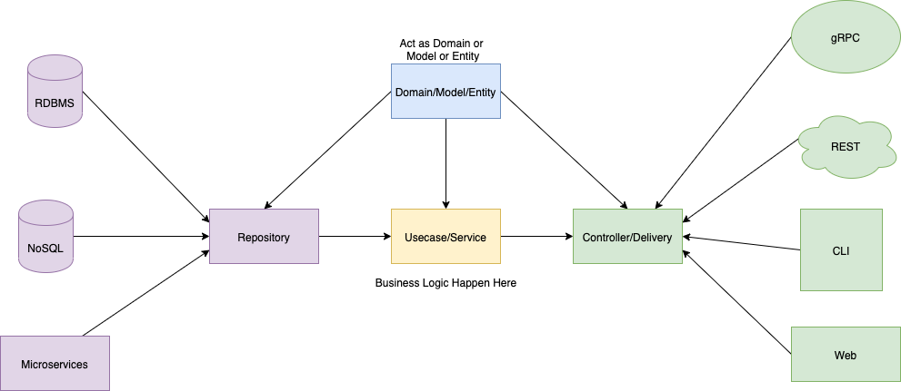
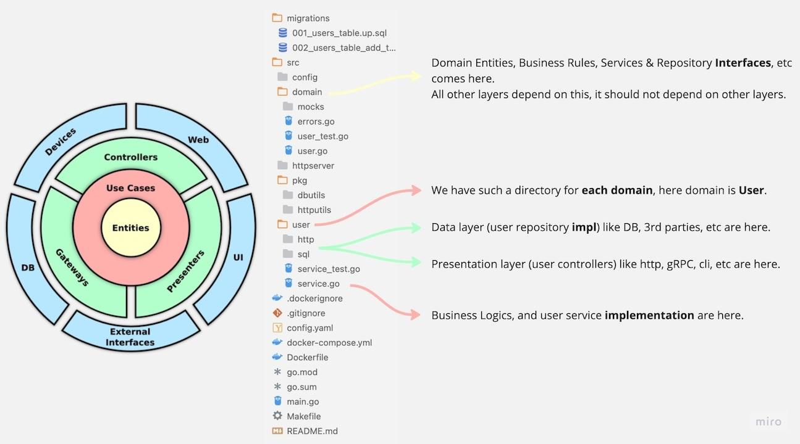

<div align="center"></div>
<br/>
<h1 align="center">Maintainable Go repository based on Clean Architecture</h1>

### 📜 Description
This Project Implemented Based on Clean Architecture in Golang.

🔰 Rule of Clean Architecture by Uncle Bob
 * Independent of Frameworks. The architecture does not depend on the existence of some library of feature laden software. This allows you to use such frameworks as tools, rather than having to cram your system into their limited constraints.
 * Testable. The business rules can be tested without the UI, Database, Web Server, or any other external element.
 * Independent of UI. The UI can change easily, without changing the rest of the system. A Web UI could be replaced with a console UI, for example, without changing the business rules.
 * Independent of Database. You can swap out Oracle or SQL Server, for Mongo, BigTable, CouchDB, or something else. Your business rules are not bound to the database.
 * Independent of any external agency. In fact your business rules simply don’t know anything at all about the outside world.

📚 More at [Uncle Bob clean-architecture](https://blog.cleancoder.com/uncle-bob/2012/08/13/the-clean-architecture.html)

📚 More at [Martin Fowler PresentationDomainDataLayering](https://martinfowler.com/bliki/PresentationDomainDataLayering.html)

### 🗺 Diagram:
<div align="center"></div>

<br/>

### 🗺 Structure:
<div align="center"></div>

### 🏃🏽‍♂️ How To Run This Project
⚠️ Since the project already use Go Module, I recommend to put the source code in any folder except GOPATH.

#### 🧪 Run the Testing

```bash
$ make test
# or for shorter version
$ make unittest
```

#### 🐳 Run App using Docker
Here is the steps to run it with `docker-compose`

```bash
# Run the application
$ make run
# check if the containers are running
$ docker ps
# See the logs
docker logs --follow oha
# test create user endpoint
$ curl -X POST 'localhost:8000/api/v1/users' --data-raw '{"name": "Amir"}'
# see created user
$ curl -X GET 'localhost:8000/api/v1/users/{user-id}'
# Stop
$ make stop
```

#### 🐻‍❄️ Run Directly
Requirements:
- Postgres > 14 
- golang > 1.20

! configure database credentials and port in `config.yaml` file.
```bash
$ go run main.go
```